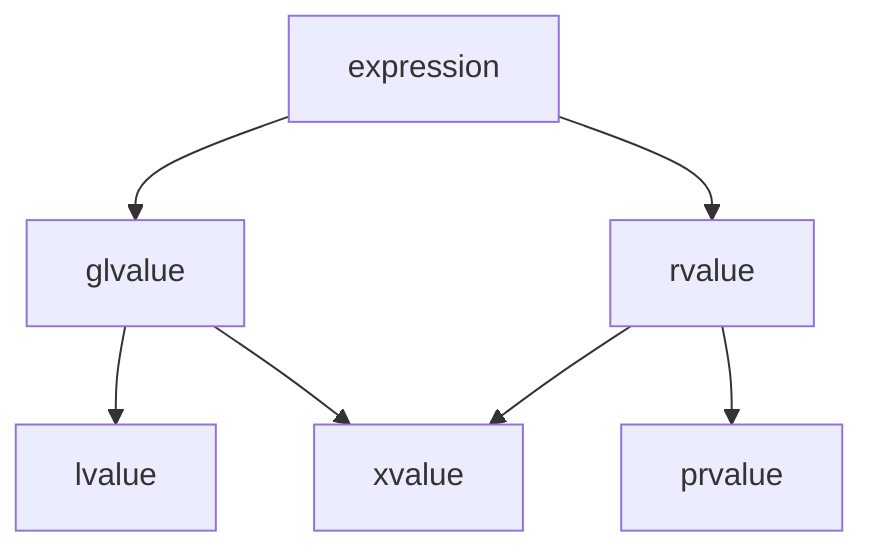

## ARTS Week1

### Algorithm

[Leetcode74.搜索二维矩阵]: https://leetcode-cn.com/problems/search-a-2d-matrix/

```c++
//74.Search-a-2d-matrix
//tag:binary_search
//edge_condition attention:lowest number and highest number
//bug point:lowest number ,and trying to access the value of end iterator
//两次二分查找，第一次二分得到的数（纵向）需要处理。
//边界条件处理：比数组内最小的数还小，最大的数还大的数，每个matrix向量的开头元素与结尾元素
//只测试了大的数没测试小的数导致vector访问越界
//可重构
class Solution {
public:
    bool searchMatrix(vector<vector<int>>& matrix, int target) {
        
        if(matrix.empty()||matrix[0].empty())
            return false;
        int n=matrix.size();
        int m=matrix[0].size();
        int l=0,r=n;
        while(l<r){//binary_search
            int mid=(l+r)/2;
            if(matrix[mid][0]>target)
                r=mid;
            else
                l=mid+1;
        }
        
        //cout<<"test:l=\t"<<l<<endl;    
        if(l!=n&&matrix[l][0]==target)
            return true;
        if(l>0)
            l--;

        auto p=lower_bound(matrix[l].begin(),matrix[l].end(),target);
        //cout<<"test:p=\t"<<*p<<endl;
        if(p!=matrix[l].end())
            return *p==target;
        else
            return false;
    }
};
```

这种方式虽然用了二分搜索，但是写的比较绕，bug也改的多，另一个角度想，实际上不必用两次二分搜索，将整个二维矩阵看作一个一维有序数组实现将更为简便，于是修改代码后：

```c++
class Solution {
public:
    bool searchMatrix(vector<vector<int>>& matrix, int target) {
        if(matrix.empty()||matrix[0].empty())
            return false;
        int k=matrix[0].size();
        int n=matrix.size()*matrix[0].size();
        int l=0,r=n;
        int x,y;
        while(l<r){
            int mid=(l+r)/2;
            x=mid/k,y=mid%k;
            if(matrix[x][y]>=target)//Lower_bound与upper_bound的区别
                r=mid;
            else
                l=mid+1;
        }
        //test:std::cout<<l<<endl;
        if(l==n)
            return false;
        return matrix[l/k][l%k]==target;
    }
};
```


### Review

https://stackoverflow.com/questions/3601602/what-are-rvalues-lvalues-xvalues-glvalues-and-prvalues

这若干回答中，针对了C++11中新引入的xvalue, glvalue和prvalue几个概念进行了简要介绍，由于智能指针的新特性和引入move语义，所以需要对原来的左值右值进行更深层的细分。其中lvalue, rvalue为左值右值，xvalue为亡值("eXpiring" value)，glvalue为泛左值（"generalized" lvalue)，prvalue为纯右值("pure" rvalue)。由下面的结构图所示，glvalue包含lvalue和xvalue，rvalue包含xvalue和prvalue。

**Quoting [n3055](http://www.open-std.org/jtc1/sc22/wg21/docs/papers/2010/n3055.pdf):**

- An **lvalue** (so-called, historically, because lvalues could appear on the left-hand side of an assignment expression) designates a function or an object. *[Example: If `E` is an expression of pointer type, then `\*E` is an lvalue expression referring to the object or function to which `E` points. As another example, the result of calling a function whose return type is an lvalue reference is an lvalue.]*

- An **xvalue** (an “eXpiring” value) also refers to an object, usually near the end of its lifetime (so that its resources may be moved, for example). An xvalue is the result of certain kinds of expressions involving rvalue references. *[Example: The result of calling a function whose return type is an rvalue reference is an xvalue.]*

- A **glvalue** (“generalized” lvalue) is an **lvalue** or an **xvalue**.

- An **rvalue** (so-called, historically, because rvalues could appear on the right-hand side of an assignment expression) is an xvalue, a temporary object or subobject thereof, or a value that is not associated with an object.

- A **prvalue** (“pure” rvalue) is an rvalue that is not an xvalue. *[Example: The result of calling a function whose return type is not a reference is a prvalue]*

  然而这里面的描述未免太过拘泥于定义，对其产生的缘由和作用过于忽视。于是在下面找到了更合理的解释：



**Stroustrup:**

​	Now I was seriously worried. Clearly we were headed for an impasse or a mess or both. I spent the lunchtime doing an analysis to see which of the properties (of values) were independent. There were only two independent properties:

- `has identity` – i.e. and address, a pointer, the user can determine whether two copies are identical, etc.
- `can be moved from` – i.e. we are allowed to leave to source of a "copy" in some indeterminate, but valid state

This led me to the conclusion that there are exactly three kinds of values (using the regex notational trick of using a capital letter to indicate a negative – I was in a hurry):

- `iM`: has identity and cannot be moved from

- `im`: has identity and can be moved from (e.g. the result of casting an lvalue to a rvalue reference)

- `Im`: does not have identity and can be moved from.

  The fourth possibility, `IM`, (doesn’t have identity and cannot be moved) is not useful in `C++` (or, I think) in any other language.

  由Stroustrup的说法，glvalue普遍`has identity`，rvalue普遍`can be moved from`,而xvalue则具有两者都有的特性。这种解释直接表明了值类别(value  category)的本质，也表明了右值引用这个东西的本质为move语义服务。

  ```
                      ______ ______
                     /      X      \
                    /      / \      \
    has identity   |   l  | x |  pr  | can be moved from
                    \      \ /      /
                     \______X______/
                         gl    r       
  ```

  

一些琐碎的东西：

1. 自增表达式中，a++是右值，++a是左值，前者在提供a的值后再将a自增，后者在自增后提供a的引用。
2. 对于引用而言，非const左值引用T &只能接受左值赋值，右值引用T &&只能接受右值赋值；唯一的例外是const左值引用const T&，它能接受左右值均可。（题外话：const这个东西，只是编译器在编译期间能够保证const修饰的object不会被直接修改，否则将编译error，与认知中的常量不太一致。只是因为编译期进行的优化可能将const修饰的对象直接优化成字面值后，未定义行为看上去没那么大错误。编译期常量请务必使用constexpr）
3. 当变量名在赋值表达式的左右两边时，其表达的概念亦不同，在左边的时候表示的是变量本身，是一个左值，在右边的时候表达的是对变量取值的一个右值（其中含有左值向右值转换的一个隐式转换）。

参考资料：

https://en.cppreference.com/w/cpp/language/value_category

https://www.youtube.com/watch?v=fbYknr-HPYE

https://www.stroustrup.com/terminology.pdf

### Technique/Tips

1. docker容器访问可以通过id前缀来进行(如ID为efdb8ff23804，可以直接使用docker exec -it efdb bash访问bash)

2. 比起直接使用new优先使用std::make_unique和std::make_shared(Modern effective C++ ITEM 21)

3. markdown可以使用flow画流程图，mermaid画组织架构图，Typora直接插入代码块里选择语言即可

   https://support.typora.io/Draw-Diagrams-With-Markdown/

### Share

[如何学得更快]: https://www.quora.com/Learning-New-Things/How-can-you-learn-faster/answer/Acaz-Pereira

通过教学的形式能有效强化记忆和塑造整体知识架构。
